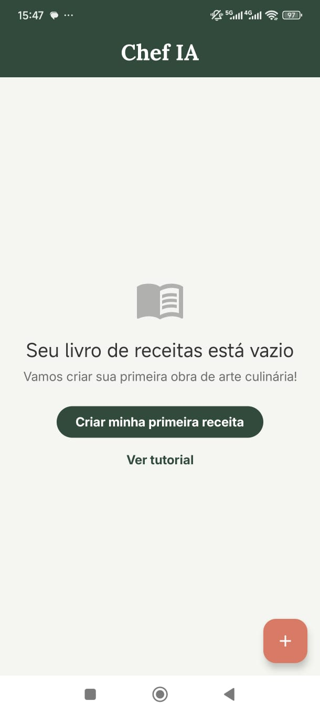
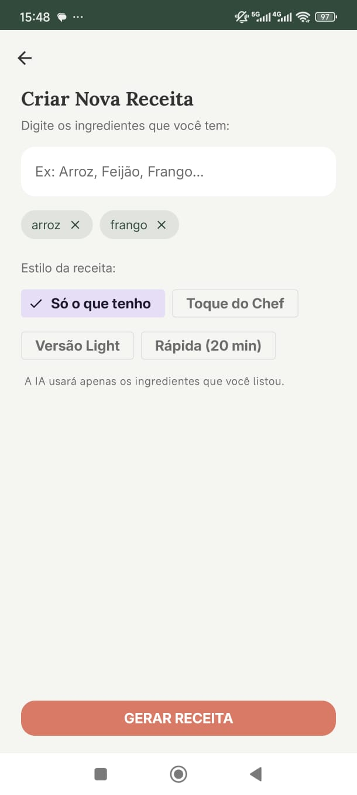
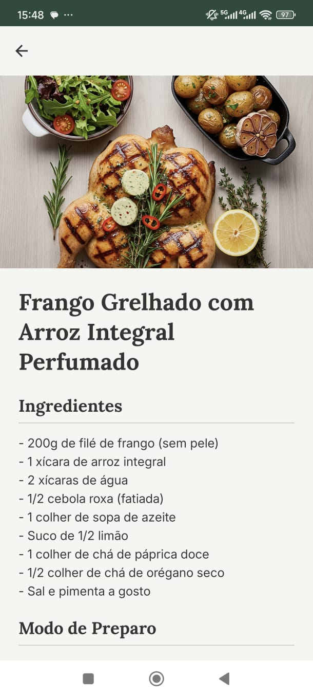

# Chef IA: Seu Assistente de Culinária Inteligente 🤖🍲

Este repositório contém o código-fonte do **Chef IA**, um aplicativo Android nativo desenvolvido como um projeto de portfólio. O objetivo do app é demonstrar a implementação de tecnologias modernas e uma arquitetura robusta para criar uma ferramenta funcional: um assistente de cozinha que utiliza a API do Google Gemini para gerar receitas a partir de uma lista de ingredientes.


### Telas Principais

|                  Home (Com Receitas)                   |              Geração de Receita              |                 Detalhes da Receita                  |
|:------------------------------------------------------:|:--------------------------------------------:|:----------------------------------------------------:|
|                 |  |  |
| [Demonstração do App Chef IA](docs/assets/example.gif) 

## ✨ Funcionalidades Implementadas

* **Geração de Receitas por IA:** O usuário insere uma lista de ingredientes e a IA cria uma receita.
* **Modos de Geração Flexíveis:** O usuário pode escolher entre os modos:
    * **Só o que tenho:** Usa estritamente os ingredientes fornecidos.
    * **Toque do Chef:** Permite que a IA sugira 1-2 ingredientes extras.
    * **Versão Light:** Foca em uma versão mais saudável.
    * **Rápida (20 min):** Prioriza receitas com preparo rápido.
* **Banco de Dados Local:** As receitas favoritas podem ser salvas no dispositivo.
* **Gerenciamento de Receitas:**
    * **Seleção Múltipla:** Toque longo para entrar no modo de seleção.
    * **Ações em Lote:** Exclusão ou compartilhamento de múltiplas receitas.
* **Compartilhamento Nativo:** Integração com a folha de compartilhamento padrão do Android.
* **Tutorial de Boas-Vindas (Onboarding):** Um guia inicial que é exibido na primeira execução do app.
* **UI Reativa:** Interface construída 100% com Jetpack Compose.

## 🛠️ Tecnologias utilizadas

* **Linguagem:** 100% [Kotlin](https://kotlinlang.org/)
* **UI:** 100% [Jetpack Compose](https://developer.android.com/jetpack/compose)
* **Arquitetura:**
    * **Clean Architecture** (dividida em camadas `ui`, `domain` e `data`)
    * **MVVM** (Model-View-ViewModel)
* **Injeção de Dependência:** [Hilt](https://developer.android.com/training/dependency-injection/hilt-android)
* **Assincronismo:** [Kotlin Coroutines](https://kotlinlang.org/docs/coroutines-overview.html) & [Flow](https://kotlinlang.org/docs/flow.html)
* **Navegação:** [Navigation Compose](https://developer.android.com/jetpack/compose/navigation)
* **Persistência de Dados:**
    * [Room](https://developer.android.com/training/data-storage/room) para o banco de dados de receitas.
    * [DataStore](https://developer.android.com/topic/libraries/architecture/datastore) para salvar as preferências do usuário (estado do onboarding).
* **API:** [Google Gemini API](https://ai.google.dev/)
* **Carregamento de Imagens:** [Coil](https://coil-kt.github.io/coil/)
* **Testes:**
    * **Unitários:** JUnit, MockK, Turbine
    * **Integração:** AndroidX Test, Google Truth

## 🚀 Como Compilar e Rodar o Projeto

Para compilar e rodar este projeto, você precisará de uma chave de API do Google Gemini.

1.  **Clone o repositório:**
    * Primeiro, obtenha o URL HTTPS do seu repositório. Na página principal do seu projeto no GitHub, clique no botão verde **`< > Code`** e copie o link.
    * No seu terminal, execute o comando `git clone` com o URL do repositório

2.  **Obtenha uma Chave de API:**
    * Vá para o [Google AI Studio](https://aistudio.google.com/) e crie sua chave de API gratuita.

3.  **Configure a Chave (Passo Essencial):**
    * Na pasta raiz do projeto, crie um arquivo chamado `local.properties`.
    * Dentro deste arquivo, adicione a seguinte linha, substituindo `"SUA_CHAVE_AQUI"` pela chave que você gerou:
        ```properties
        GEMINI_API_KEY="SUA_CHAVE_AQUI"
        ```

4.  **Abra no Android Studio:**
    * Importe o projeto no Android Studio, aguarde o Gradle sincronizar e clique em "Run".
